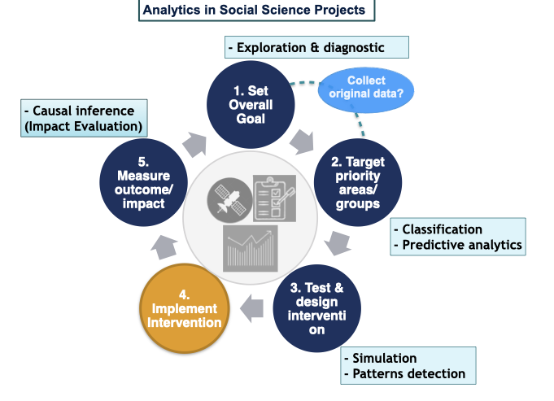

```{r setup, include=FALSE}
knitr::opts_chunk$set(echo = FALSE)
```

Over the years, I have worked on the entire analytics project cycle for several research projects within the economic development and social science fields. Below are the areas in which I have direct, hands-on expertise. 

## Data collection & analysis \| Statistics \| Econometrics

✔️ **Relational databases**: I have designed and interacted with databases to perform extract-transform-load (ETL) tasks\
✔️ **Webscraping** and retrieving data from different sources (via APIs, open repositories, web applications, census, etc.)\
✔️ **Data cleaning** & Exploratory Data Analysis (EDA)\
✔️ **Data visualization & dashboards** to identify outcomes frequency distributions, patterns, outliers\
✔️ Design and analysis of **surveys** (including sampling strategy)\
✔️ Descriptive & inferential **statistics**\
✔️ **Regression** and multivariate analysis\
✔️ **Text analysis** and NLP (Natural Language Processing) 🆕\
✔️ **Communicating analysis' results** in different forms (reports, journal articles, blog posts, slides, dashboards project websites)\
✔️ Creating **static websites** (personal blog, project site, etc.)  ---using `R{distill}` -▶️ `GitHub Pages`-▶️ `AWS` (for vanity domain registration)\ <br><br>

I have also learned the incredible benefits of properly storing and documenting each and every piece of the analytical process (raw data, code, derived data and analysis) so that you (and potential collaborators) can easily go back to it when needed: a.k.a. ***version control*** (see an inspiring [article by Jenny Bryan](https://www.researchgate.net/publication/344990307_Excuse_me_do_you_have_a_moment_to_talk_about_version_control/fulltext/5f9fb3b5299bf1b53e59cad5/Excuse-me-do-you-have-a-moment-to-talk-about-version-control.pdf?_sg%5B0%5D=a1lfXtxrZ7BRfcB5gDFXpYUHYDRpZ7fe7vqfIr1p18_cRUlIRVLQWaF_hGh4a8GKKoBGESpz4VuK63FxqQH1hw.c7hLP-njJDk2obi2Ij69MDNL7mKxKNMUMUacM-qYO8DOul_1ojUD4DYlmH3KmmjAtx1TizFf34LzDl3kJ17sCg&_sg%5B1%5D=GhJcqrYp-gtN3fgnCxfxGj2fE2d4UlYvHPsJphhY27zyarq5LKCIsQNAAkTLG1IX0Nttlb-UERMBzCRq16CpOo8BgwLRE2a0qnhdU2G-D2DW.c7hLP-njJDk2obi2Ij69MDNL7mKxKNMUMUacM-qYO8DOul_1ojUD4DYlmH3KmmjAtx1TizFf34LzDl3kJ17sCg&_iepl=)]). Since I also embrace the goal of making research as open as possible, I care a lot about this too:

✔️ Setting up a **transparent, collaborative & reproducible data science workflow** ---using `R/RStudio` and `git/GitHub`\ <br><br>

   <br><br>

## Technical writing \| Editing

I am a native Italian 🇮🇹 speaker but I have published extensively in English 🇺🇸 ---including in peer-reviewed journals--- as I lived/studied/worked in the USA for 14 years. I also have conversational knowledge of Spanish 🇪🇸 and Portuguese 🇧🇷.

Hence, I can effectively assist also with:

✔️ **Outlining an article** or technical/business report\
✔️ **Editing and/or proofreading** technical reports, theses and academic articles\
✔️ Revising and **improving CVs**, cover letters or documents for job applications\
✔️ Preparing and/or revising **grant proposals**\
✔️ Setting up **fast and automatic update of recurring reports** (e.g. quarterly sales, periodic fundraising outreach, etc.) via scripted programming (`SQL`, `R`, `Markdown`) and tools for version control and automation (`git`, `make`)\
 

<!-- <p style="font-size:10pt">

*[Italian version](https://luisamimmi.org/Consulting_ITA.html)* 

</p> -->
--- 

<p style="color:#a21048;"> _[Legal permanent resident authorized to work in the US]_ </p>
