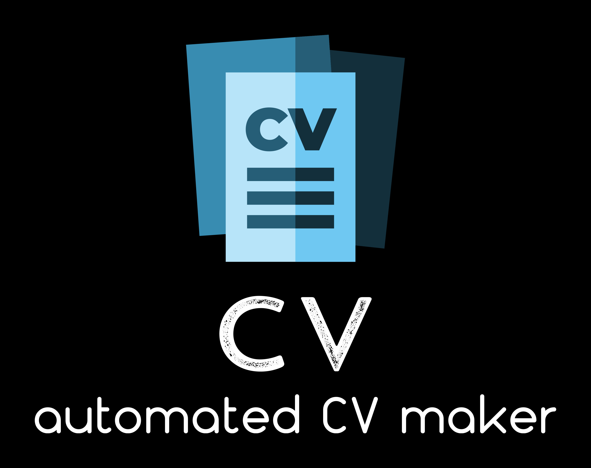
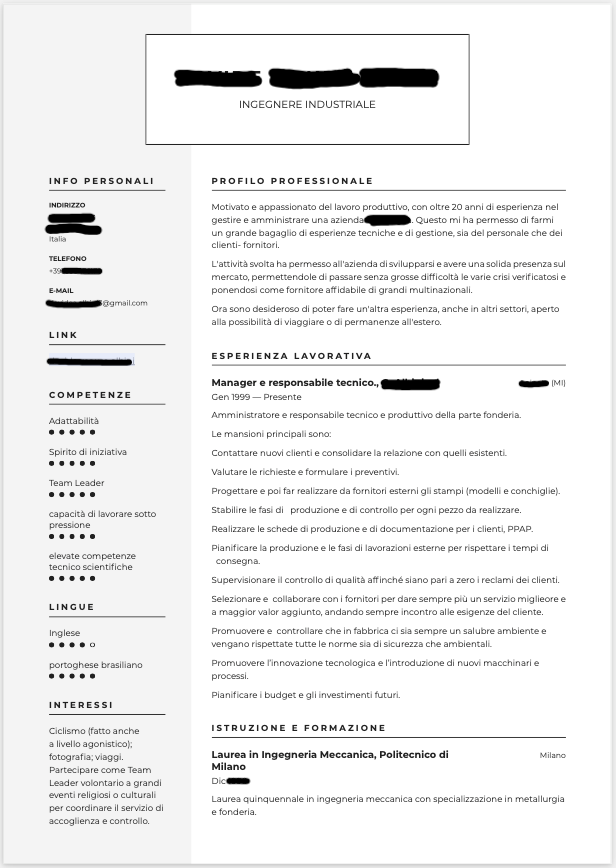
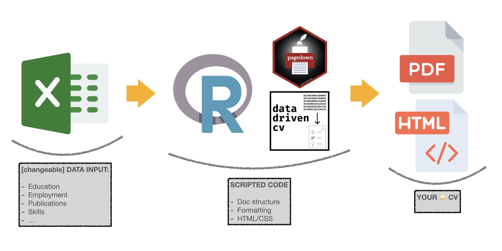
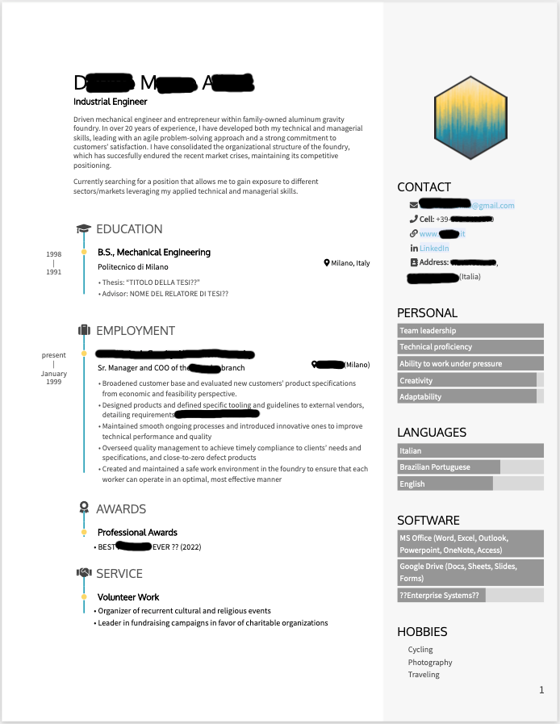

```{r setup, include=FALSE}
knitr::opts_chunk$set(echo = FALSE,
                      out.width = "100%")
```

```{r, eval=FALSE}

```

```{r, eval=FALSE, echo=FALSE,out.width="50%",out.height="50%",fig.show='hold', fig.align='center', fig.cap="The "}

knitr::include_graphics(c("Before_CV_anon2.png","After_CV_anon.png") )

```

# The client's request

A friend asked my help to translate a résumé from Italian to English.[^1]

[^1]: A **résumé** is a synthetic type of CV, commonly used in the US for business job interviews, which ideally fits in 1 page.

Figure \@ref(fig:fig1) shows the Italian version which was given to me as an input ---formatted via one of those online sites that render your content based on a few given graphic options. Great...except every time he needs to update/revise such résumé, he will have to re-type the text on the app from scratch 🙁.\

```{r fig1, echo=FALSE, fig.align='center', fig.cap= "The \"Before\" version (_sensitive data have been covered in black_)"}

```

### A time-consuming alternative

Probably, we have all tried the obvious alternative: doing your own formatting in a word processor like ***MS Word*****.** Here, one retains ownership on the process, but at the cost of spending more time dealing with graphic details. In fact, this will also require re-formatting every time the content changes (pagination, font sizes, interline spaces, margins, etc.). Plus, we are not all born designers, so we might end up with a not-so-professional looking output 🥴.

# My proposal

Having gone myself through this utterly tedious process more times than I wish to admit, I wanted to explore a CV-making process that would allow me to **set up the template once and then make all subsequent changes in an automated way** (i.e. without worrying about adjusting the format anymore).

The `r fontawesome::fa("r-project", fill = "#5F85A7")` ecosystem offers several ways to achieve this, but in this case I decided to try one that builds on two R packages [`pagedown`](https://pagedown.rbind.io/) and [`datadrivencv`](http://nickstrayer.me/datadrivencv/)---the latter created by [Nick Strayer](https://nickstrayer.me/), a talented Visual Data Scientist. The above R packages also came with pre-installed graphical options that I tweaked lightly, again relying on the resources made available by another open source contributor: scientist/developer [Jake Thompson](https://www.wjakethompson.com/).[^2]

[^2]: Having limited experience with **HTML and CSS** (the tools of web designers), I tend to rely on experts' templates and then gradually (& minimally) tweak individual features according to my taste.

This is what the workflow looks like (Figure \@ref(fig:fig2) )

```{r fig2, echo=FALSE, fig.align='center', fig.cap= "Workflow (Free icons downloaded from [Flaticon](https://www.flaticon.com/free-icons))"}

 
```

# The final product

The resulting revised résumé is shown in Figure \@ref(fig:fig3). In my opinion, this format is clean and professional, without looking too boring. I particularly like the graphical way to illustrate skills, which is very intuitive and gives a comparative sense of what each person focuses on.

```{r fig3, echo=FALSE, fig.align='center', fig.cap= "The \"After\" version (_sensitive data have been covered in black_)"}

```

Please note, I had been asked for a generic résumé (i.e. not aimed at responding to a specific job posting), so I did not put to much emphasis on the content, although I used my knowledge of the US job market (in which I was both job candidate and recruiter at different times) to "localize" it a bit. However, now that the project is set up (in a shareable directory containing all the files and code), it will be extremely easy and quick to make subsequent content changes. Indeed, one of the best features of this packages is that **the R program that constructs and renders the final CV/résumé can be fed from plain** ***MS Excel*** **sheets**---a tool that most people are comfortable with.

::: {.note style="background-image: url(lightbulb.png)"}
To update the CV/résumé, it will suffice to modify the **input MS Excel file**.
:::


### Some closing remarks

If you are thinking "Why bother?" or "Isn't this too much work to update a CV?", I think it is because you are among the lucky ones who haven't had to apply to many jobs in their career. If, instead, you are in an earlier stage of your career or (like consultants) have a more dynamic job situation, I believe this is the winning strategy.

More concretely, I invested half a day in setting this up (it was my 1st time using these R packages and I wanted to customize a bit the template). But from now on, unless I get bored of the graphical template and want to tweak it, any future update will be a matter of minutes. All I will have to do is simply change a few cells in the input *MS Excel* file, `execute` and *voilà*.
